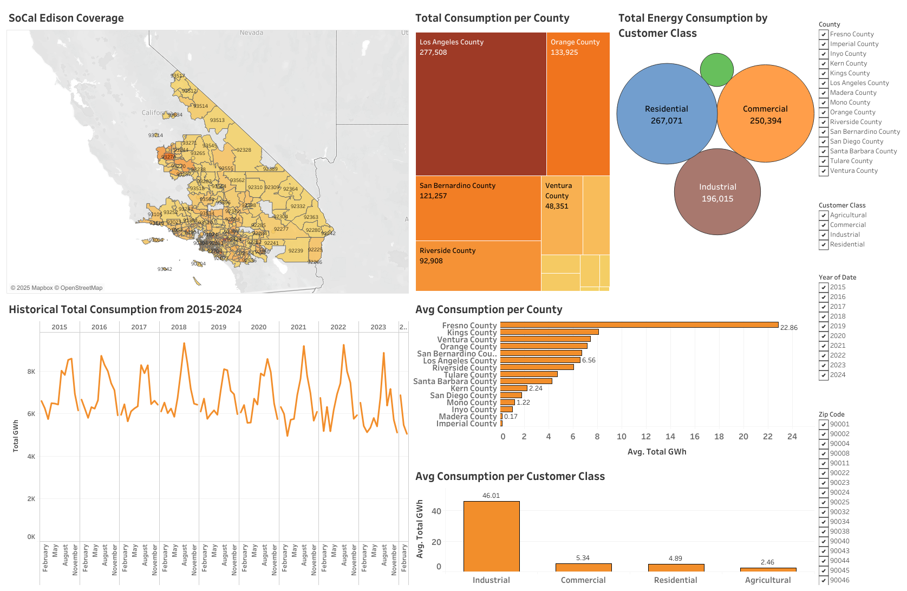
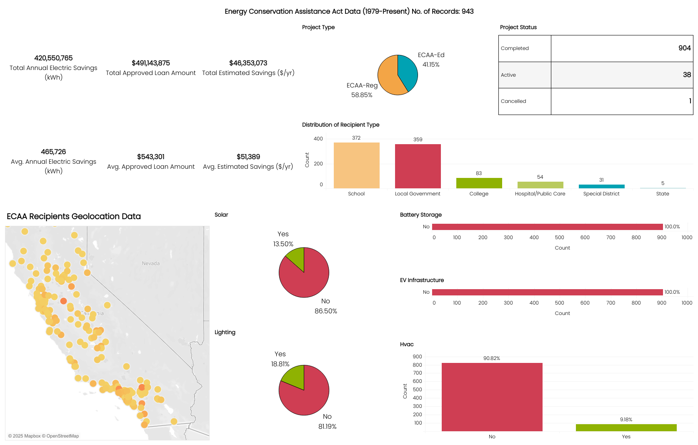

# Forecasting Energy Demands for SoCal Edison (2025.Q1-2025.Q4)

## Overview:
- This project analyzes and forecasts the overall energy consumption of SoCal Edison customers. **Forecasts are projected for 2025.Q1 to 2025.Q4**. Analysis also includes the distribution of consumption between the types of customers. Predictions are made for total combined energy consumption for all SoCal Edison customers and also by county. The objective is to develop a comprehensive system to forecast future energy requirements by county, supporting SCE in infrastructure development and resource allocation. This project also aims to create customized energy-saving programs for areas with high energy usage.

- Data used is from SoCal Edison energy reports available for public access. Data was merged with a Southern California Zip Code dataset to categorize and group customers' zip codes into associated counties.

## Tools & Technologies Used:
- **Python:** the core tool utilized in this project, along with the required data analysis and machine learning libraries.

## View Project Presentation & Analysis:
- [SoCal Edison Forecasting Energy Models & Strategies](https://docs.google.com/presentation/d/1sR1rW84EqTw05AtBUeik8HTe1tzZBlPAB_XILUAd78w/edit?usp=sharing)

## View Descriptive Analysis Dashboard:
- [Tableau Dashbaord Link](https://public.tableau.com/views/CPPDATeamSCEProjectDashboard/Dashboard1?:language=en-US&:sid=&:redirect=auth&:display_count=n&:origin=viz_share_link)
### Preview:

## View Project Code:
- [Total Combined Energy Forecast Model](https://github.com/adamchua97/sce-forecasting-energy-demand-analysis/blob/main/sarimax_model.ipynb)
- [County Forecasting Models](https://github.com/adamchua97/sce-forecasting-energy-demand-analysis/tree/main/sce_county_forecasts)
- [Time Decomposition Model For Seasonality & Trends Analysis](https://github.com/adamchua97/sce-forecasting-energy-demand-analysis/blob/main/time_decomposition_model.ipynb)

## Summarized Research on Political & External Factors Affecting Energy Consumption of SoCal Edison Customers:
- [Presentation Link](https://docs.google.com/presentation/d/1PUn2eLCF3KBeIE1hjyLu1G7EbrfTC7b8rp3-ABbfjzA/edit?usp=sharing)

## View Energy Conservation Assistance Act Data Dashboard
- The California Energy Commission’s [Energy Conservation Assistance Act (ECAA)](https://www.energy.ca.gov/programs-and-topics/programs/energy-conservation-assistance-act) offers zero-interest rate loans to public schools and 1 percent rate loans to public entities and California Native American Tribes. Loans finance , energy efficiency and energy generation projects, energy storage systems, and electric vehicle charging infrastructure.
- [Tableau Dashboard Link](https://public.tableau.com/app/profile/adam.chua4816/viz/ECAA2025Dashboard/Dashboard1)
### Preview:

